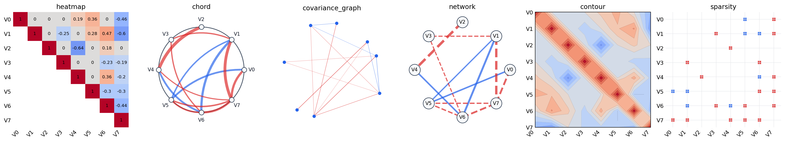
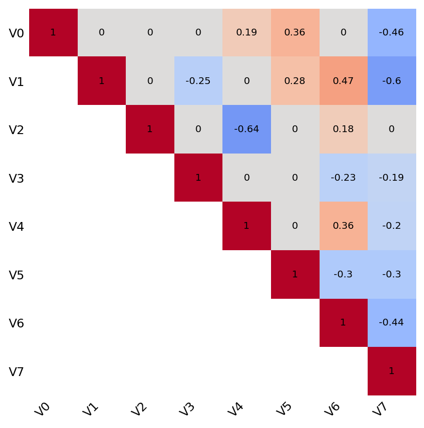
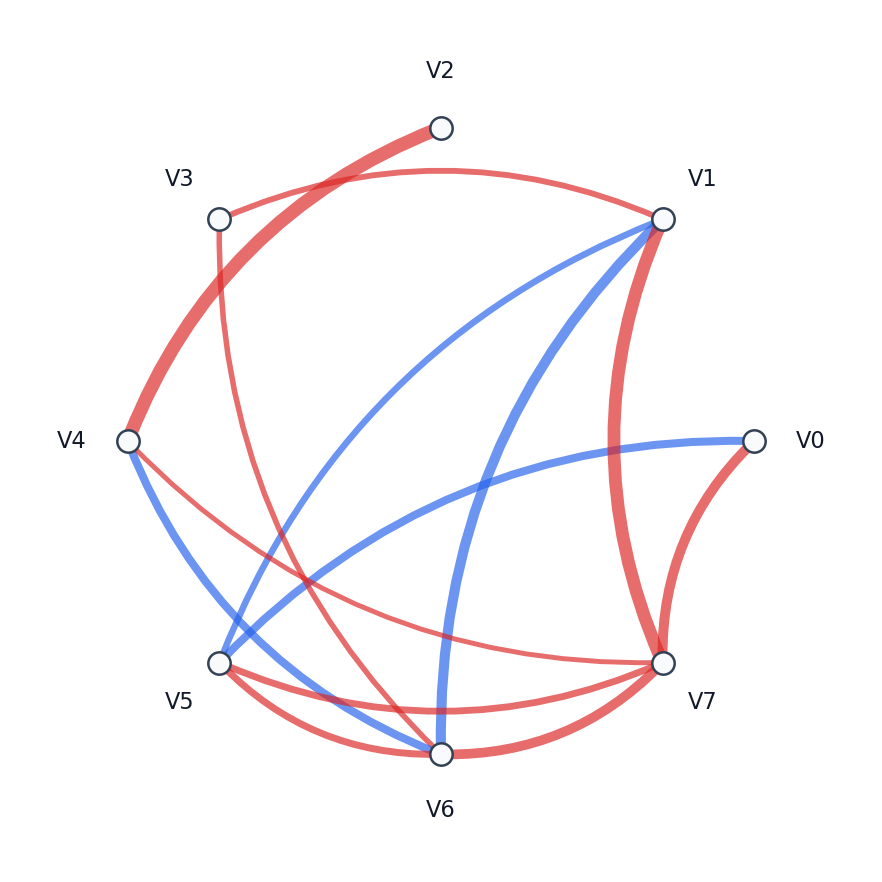
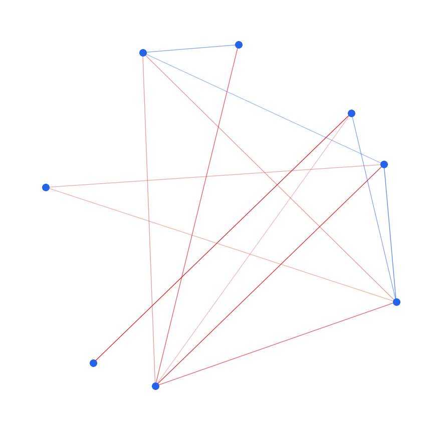
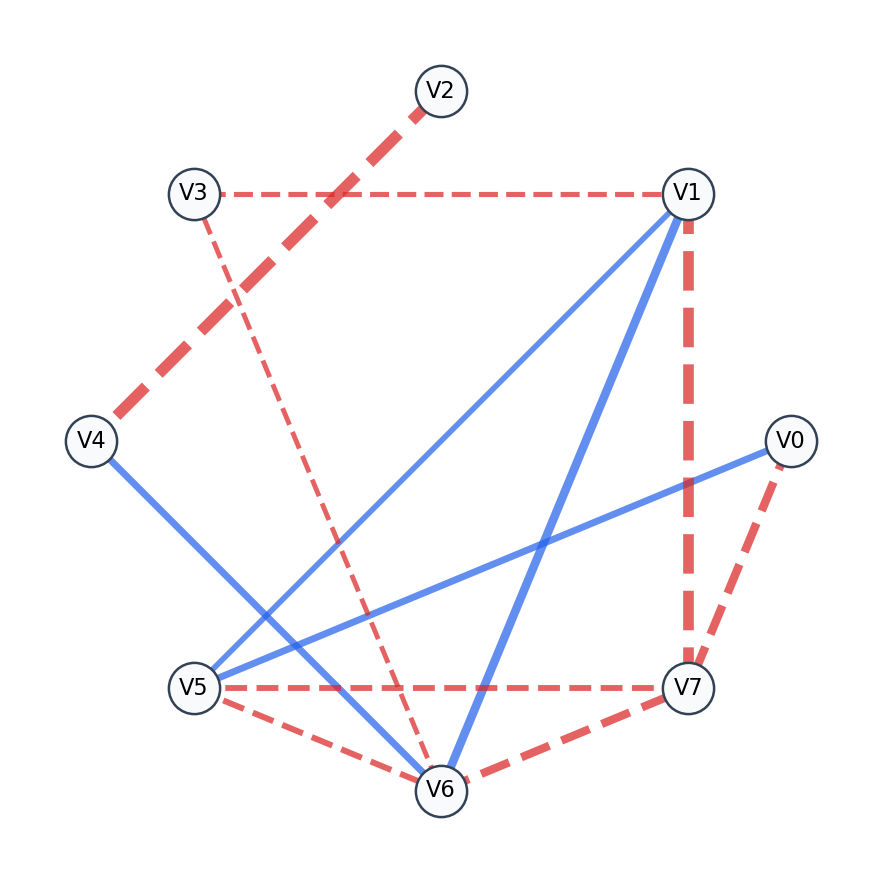
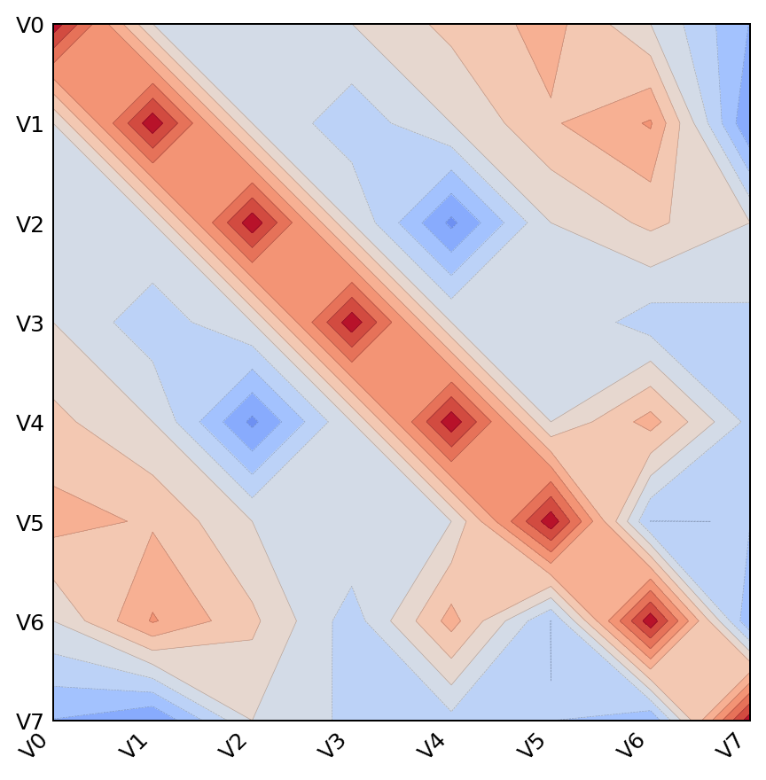
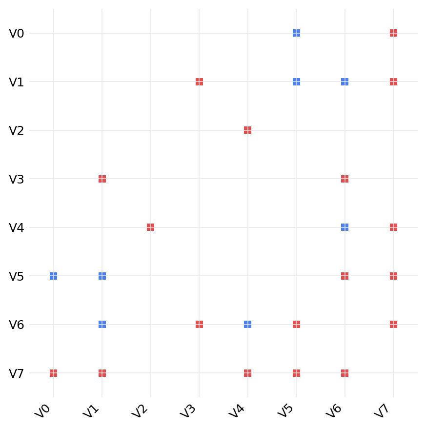

# covviz

`covviz` is a small Python package for adaptive visualization of symmetric
covariance-like matrices. It accepts one matrix or many matrices and returns a
Matplotlib figure with either one panel or an automatically arranged grid.

## Gallery



`covviz` currently includes heatmap, chord, covariance graph, network, contour,
and sparsity views for the same symmetric matrix:

| Heatmap | Chord | Covariance Graph |
| --- | --- | --- |
|  |  |  |

| Network | Contour | Sparsity |
| --- | --- | --- |
|  |  |  |

## Install

Install the latest version directly from GitHub:

```bash
pip install git+https://github.com/yixinyan77/covviz.git
```

For local development, clone the repository first and then install it in
editable mode:

```bash
git clone https://github.com/yixinyan77/covviz.git
cd covviz
pip install -e .
```

Install development dependencies for running tests:

```bash
pip install -e ".[dev]"
```

`pip install covviz` will work only after the package is published to PyPI.

## Quick Start

```python
import numpy as np
import covviz as cv

rng = np.random.default_rng(0)
x = rng.normal(size=(8, 8))
cov = x @ x.T

fig, axes = cv.plot(cov, kind="heatmap")
fig.savefig("covariance-heatmap.png", dpi=200)
```

All plotting calls return `(fig, axes)`, so the result can be saved or adjusted
with normal Matplotlib methods.

Multiple matrices are arranged automatically:

```python
matrices = [cov, cov * 0.7, cov * 1.2]

fig, axes = cv.plot(
    matrices,
    kind="chord",
    labels=[f"V{i}" for i in range(8)],
    titles=["A", "B", "C"],
)
```

Network view:

```python
cv.plot(cov, kind="network", threshold=0.25)
```

Covariance graph view:

```python
cv.plot(cov, kind="covariance_graph", threshold=0.25)
```

Annotated upper-triangle heatmap:

```python
cv.plot(cov, kind="heatmap", triangle="upper", annotate=True, colorbar=False)
```

Contour and sparsity views:

```python
cv.plot(cov, kind="contour", levels=16)
cv.plot(cov, kind="sparsity", threshold=0.5)
```

## Plot Types

The current MVP supports:

| Kind | Best For |
| --- | --- |
| `heatmap` | Quickly inspecting signed magnitude patterns. |
| `chord` | Showing strong pairwise relationships around a circular layout. |
| `covariance_graph` | Compact graph comparisons in covariance-estimation experiments. |
| `network` | More explicit node-link structure with labels and signed edges. |
| `contour` | Treating the matrix as a smooth surface-like field. |
| `sparsity` | Inspecting thresholded support or zero/nonzero structure. |

## Input Rules

Inputs may be:

- A single `numpy.ndarray`.
- A list of arrays with the same shape.
- A pandas `DataFrame` whose index and columns match.

Matrices must be square and symmetric. Non-finite values are rejected. For
covariance matrices this catches common data issues early, before a plot is
created.

## API

```python
fig, axes = cv.plot(
    matrices,
    kind="heatmap",
    labels=None,
    titles=None,
    ncols="auto",
    figsize="auto",
    check_symmetric=True,
    share_scale=True,
)
```

`axes` is always returned as a flat list, even for a single matrix.

## Roadmap

- Add GitHub Actions release checks and PyPI publishing workflow.
- Add modularity/community visualization as an optional extra.
- Add richer documentation notebooks.
- Publish to PyPI after the first GitHub release.
